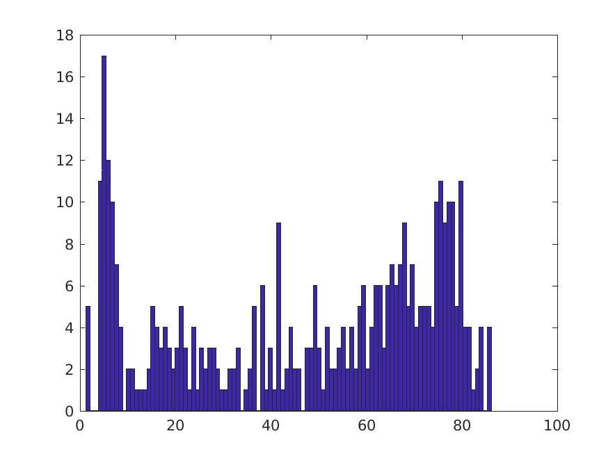

# Content

Data used for the expected results of the system tests.

```bash
 ├── TYPEB_FITHRF.mat
 ├── TYPEC_FITHRF_GLMDENOISE.mat
 └── TYPED_FITHRF_GLMDENOISE_RR.mat
```

Contain the expected value for:

- `HRFindex` values for `results{2:4}` for `tests/test_glmsingleunit.m`.

`TYPED_FITHRF_GLMDENOISE_RR.mat` also contains `R2` values.

Generated with MATLAB 2017a on Ubuntu 18.04.

If new expected data needs to be generated, this can be done from the output of
`tests/test_GLMestimatesingletrial.m` that will be saved in `tests/outputs`.

Some basic sanity checks can be run on those data with
`tests/expected/matlab/sanity_checks.m`

- like making sure that the there is nothing "strange" in the range of R2 values
  tested.


